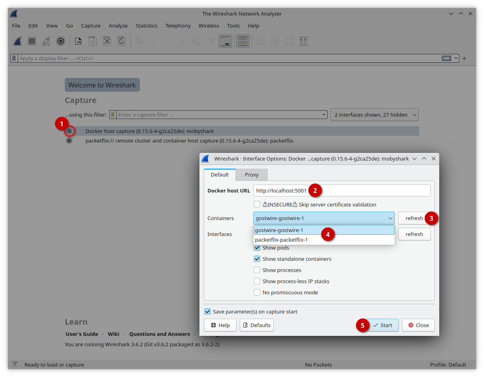

[](https://github.com/siemens)
[](https://github.com/industrial-edge)
[](https://github.com/siemens/edgeshark)

# Packetflix

[](https://pkg.go.dev/github.com/siemens/packetflix)
[](https://img.shields.io/github/license/siemens/packetflix)

[](https://goreportcard.com/report/github.com/siemens/packetflix)

> **Finally! Container "binge watching" live _packet_ streams for
> Wireshark(nado) nerds!**

Or much less nerdy: capture network traffic inside (Docker, &c.) container hosts
and Kubernetes-in-Docker clusters ... and stream it live into your Desktop
Wireshark for Windows/Linux.

But Packetflix is not limited to Wireshark scenarios, but could be used also in
other applications, such as AI-based network traffic analysis, et cetera.

Packetflix...

- ...is a micro service which runs on container hosts.
- ..."understands" containers so it can capture from them **without preparing or
  modifying** your containers beforehand for capturing.
- ...no container restarts required to start capturing, just let "El Shark" bite
  into your containers as you please.
- ...streams packet capture data via websocket connections, thus being
  compatible with HTTP/websocket proxies.
- ...is **not** a containerized Wireshark.
- ...works on amd64 and arm64.

## Quick Start

We provide multi-architecture Docker images for `linux/amd64` and `linux/arm64`.
First, ensure that you have the Docker _compose_ plugin v2 installed. For Debian
users it is strongly recommended to install docker-ce instead of docker.io
packages, as these are updated on a regular basis.

```bash
wget -q -O - \
  https://github.com/siemens/edgeshark/raw/master/deployments/wget/docker-compose.yaml \
  | docker compose -f - up
```

Finally, visit http://localhost:5001 and start looking around Linux kernel
namespaces, as well as mount points with their hierarchies.

> ⚠ This quick start deployment will **expose TCP port 5001** also to clients
> external to your host. Make sure to have proper network protection in place.

## Eye Candy

Since _micro services never look cool_, here's a screenshot of a Desktop
Wireshark session instead: here, we're going to capture from containers in a
Docker host:



No more ugly command lines, no "poking" around in container details ... just
four clicks (well, five) and you're capturing live network traffic from inside
any container. And without having to prepare or modify your containers
beforehand.

## Project Map

The Containershark extcap plugin is part of the "Edgeshark" project that consist
of several repositories:

- [Edgeshark Hub repository](https://github.com/siemens/edgeshark)
- [G(h)ostwire discovery service](https://github.com/siemens/ghostwire)
- 🖝 **Packetflix packet streaming service** 🖜
- [Containershark Extcap plugin for Wireshark](https://github.com/siemens/cshargextcap)
- support modules:
  - [csharg (CLI)](https://github.com/siemens/csharg)
  - [mobydig](https://github.com/siemens/mobydig)
  - [ieddata](https://github.com/siemens/ieddata)

## Deploying Packetflix

Building the Packetflix service requires the Go toolchain, `make`, a C compiler
(used by cgeo), and finally Docker installed.

After deploying the [Ghostwire](https://github.com/siemens/ghostwire) service first, Packetflix can be deployed in the same way:

```bash
make deploy
```

> **⚠️** Packetflix does not have any integrated support for TLS (HTTPS).
> Instead, deploy a TLS-terminating and authenticating proxy in front of
> Packetflix with single-host container hosts.

## Packetflix Service Args

- `--port`, `-p`: port to expose the capture service on, defaults to port 6666.
- `--gw-port`: local port where the GhostWire discovery service can be reached,
  defaults to port 5000.
- `--proxy-discovery`: enables forwarding HTTP requests to the Ghostwire
  discovery service at `/`, unless they're part of the Packetflix API.

- `--debug`: enables debugging messages.
- `--log-requests`: log HTTP/WS requests.
- `--log-headers`: log HTTP/WS request headers.

- `--version`: show version string.
- `--help`, `-h`: show help with available flag paremeters.

## Container Deployment Notes

### Packetflix in a Container

Packetflix **must** be run in the initial PID namespace, there's no way around it
– it is how PID namespaces are designed to work, not allowing child (that iss,
container) PID namespaces to touch any parent PID namespace or any sibling PID
namespace of a parent.

```yaml
services:
  packetflix:
    # Essential since we need full PID view.
    pid: host
```

#### Put Your Caps On

Packetflix requires the following Linux capabilities (and yes, `CAP_SYS_ADMIN`
and `CAP_SYS_PTRACE` make any Marvel universe figure look powerless) listed
below. Some capabilities are required when running packetflix as a non-root
process (that is, not as UID0).

- `packetflix`:

  - `CAP_SYS_ADMIN` is needed in order to switch into other namespaces, such as
    the network namespaces of containers. See also [man 7
    setns](https://man7.org/linux/man-pages/man2/setns.2.html).

  - `CAP_CHROOT` is additionally needed to switch into mount namespaces of
    containers, in order to read their DNS configuration files (such as
    `/etc/host`, `/etc/resolve`, et cetera). See also [man 7
    setns](https://man7.org/linux/man-pages/man2/setns.2.html).

  - `CAP_SYS_PTRACE` in order to be able to reference namespaces: the
    `nsfs` (namespace) filesystem requires this "god" capability in order to
    access namespace-related `/proc` nodes, such as `/proc/$PID/ns/*`. And
    GhostWire does not even use any `ptrace(2)` syscalls, it just reads from
    `/proc`. Another clear victory for the capabilities architecture: in order to
    discover namespaces, give the process process tracing and modification powers.
    Please see also [Access /proc/pid/ns/net without running query process as
    root?](https://unix.stackexchange.com/questions/443382/access-proc-pid-ns-net-without-running-query-process-as-root)
    for details and references to the `nsfs` filesystem involved.

- `dumpcap`:

  - `CAP_NET_ADMIN` is needed in order to configure network interfaces for promiscuous
    mode, et cetera.

  - `CAP_NET_RAW` is required in order to capture network traffic.

```yaml
services:
  packetflix:
    cap_drop:
      - ALL
    cap_add:
      - SYS_ADMIN # change namespaces
      - SYS_CHROOT # change mount namespaces
      - SYS_PTRACE # access nsfs namespace information
      - CAP_NET_ADMIN # to configure network interface capturing
      - CAP_NET_RAW # for, erm, well, capturing?
```

### Root(h)less

Packetflix can be run as a non-root user process, when given the above mentioned
capabilities. The required (effective) capabilities can be given to a non-root
process by using file capabilities:

- `/packetflix`
- `/usr/bin/dumpcap`

### Packetflix Container and AppArmor

Docker's default container AppArmor profile breaks Packetflix's and the
namespace discovery process, causing kernel log messages of this kind:

```
audit: type=1400 audit(...): apparmor="DENIED" operation="ptrace" profile="docker-default" pid=... comm="gw" requested_mask="read" denied_mask="read" peer="unconfined"
```

This is caused by Docker's [default AppArmor template
profile](https://github.com/moby/moby/blob/master/profiles/apparmor/template.go),
which allows ptrace operations only within the same container, by specifying the
container-specific AppArmor profile name:

```
# suppress ptrace denials when using 'docker ps' or using 'ps' inside a container
ptrace (trace,read,tracedby,readby) peer={{.Name}},
```

Packetflix containers thus need to be deployed with either an especially adapted
AppArmor profile or as an unconstrained container. In your
`docker-compose.yaml`, add the following settings for the packetflix service/container:

```yaml
services:
  packetflix:
    security_opt:
      - apparmor:unconfined
```

### Packetflix Container and Seccomp

Docker's default container seccomp profile luckily doesn't interfere with
Packetflix's workings, as it actually allows the evil haxxor `setns` syscall,
contrary to any [claims in Docker's documentation that `setns` is
blocked](https://docs.docker.com/engine/security/seccomp/#significant-syscalls-blocked-by-the-default-profile).
In fact, the code repository
[profiles/seccomp/default.json](https://raw.githubusercontent.com/moby/moby/master/profiles/seccomp/default.json)
shows that `setns` is in fact **allowed**:

```json
  {
    "names": [
      "bpf",
      "clone",
      "fanotify_init",
      "lookup_dcookie",
      "mount",
      "name_to_handle_at",
      "perf_event_open",
      "quotactl",
      "setdomainname",
      "sethostname",
      "setns",
      "syslog",
      "umount",
      "umount2",
      "unshare"
    ],
    "action": "SCMP_ACT_ALLOW",
    "args": [],
    "comment": "",
    "includes": {
      "caps": [
        "CAP_SYS_ADMIN"
      ]
    },
    "excludes": {}
  },
```

## Technical Details

- [HTTP/websocket API](api.md) documentation.
- [Service Sequence Diagrams](sequences.md).

# Contributing

Please see [CONTRIBUTING.md](CONTRIBUTING.md).

## License and Copyright

(c) Siemens AG 2023

[SPDX-License-Identifier: MIT](LICENSE)
